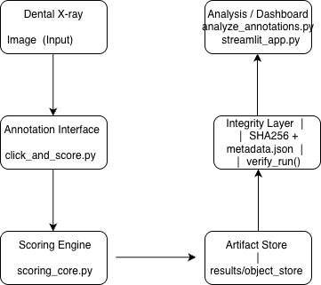

This repository demonstrates how human annotation pipelines can be implemented with reproducibility guarantees and artifact integrity checks,similar to production data pipelines used in cloud infrastructure systems.

# Dental Panoramic X-ray Scoring Pipeline

A reproducible, human-in-the-loop system for scoring dental panoramic X-rays.

The system generates versioned artifacts, visual overlays, and structured metadata to support clinical QA, dataset curation, and machine learning
development.

This project demonstrates correctness-first data pipeline engineering,immutable artifact storage, and reproducible execution similar to modern object storage systems.

## System Overview

The pipeline standardizes human annotations on panoramic dental X-rays and produces reproducible scoring artifacts.

Key features:

- Human-in-the-loop landmark annotation
- Explainable visual overlays
- Immutable artifact storage (S3-style object layout)
- Reproducible runs with integrity verification
- Noise-sensitivity analysis for annotation stability

## Example Output

Each scoring run generates:

- `overlay.png` – visual explanation of measurements
- `overlay.json` – structured scoring data
- `metadata.json` – run metadata and artifact hashes
- `summary.json` – compact output for analytics

results/object_store/xray/overlays/
└── case_id=104/
└── run_id=b7419b98/
├── input/
├── metadata.json
├── overlay.json
├── overlay.png
└── summary.json

Each run is immutable. New runs produce new `run_id` directories.

This design mirrors object storage systems,
enabling reproducibility and auditability.

## Artifact Integrity

Artifacts are stored using a partitioned object-store layout:

dataset=xray / artifact=overlay / case_id / run_id

This layout enables efficient querying, reproducibility, and auditability.

Each pipeline run produces a `metadata.json` file that records:

- SHA-256 hashes of all artifacts
- input image hash
- canonical configuration hash
- code version (git commit)

The `verify_run()` function recomputes hashes and ensures
the run directory has not been modified.

Example:

python -m src.integrity results/object_store/xray/overlays/case_id=104/run_id=b7419b98

## Scoring Logic

The system computes three clinical scores:

C2 – Bone balance (left/right symmetry)  
C3 – Upper midline centering  
C4 – Upper vs lower midline alignment

Measurements are derived from annotated landmarks and
converted to physical units using EXIF DPI or estimated
panoramic width when calibration is unavailable.

## Analysis Components

The repository includes tools for evaluating annotation quality:

- Annotation audit (`analyze_annotations.py`)
- Noise sensitivity evaluation (`noise_sensitivity.py`)
- Dataset visualization (Streamlit dashboard)

```bash
pip install -r requirements.txt
```

```bash
python -m src.click_and_score
```

```bash
python -m src.integrity results/object_store/xray/overlays/case_id=XXX/run_id=XXX
```

```bash
streamlit run src/streamlit_app.py
```

## Cloud Deployment Mapping

The system is designed to map directly to cloud infrastructure:

| Component           | Cloud Equivalent        |
| ------------------- | ----------------------- |
| ObjectStore         | S3 / GCS                |
| click_and_score     | Lambda / Cloud Function |
| scores.csv          | Athena / BigQuery       |
| overlay artifacts   | object storage browser  |
| analysis scripts    | batch jobs              |
| Streamlit dashboard | Cloud Run / EC2         |

## Engineering Highlights

- Immutable artifact storage design
- Reproducible pipelines with integrity verification
- Human-in-the-loop annotation system
- Noise-sensitivity analysis for measurement stability
- Cloud-ready architecture

## Design Principles

The system is designed around several engineering principles:

- **Immutability** – Each scoring run produces a new `run_id` directory.
- **Reproducibility** – All artifacts include configuration and input hashes.
- **Integrity Verification** – SHA-256 checks ensure outputs are unchanged.
- **Separation of Concerns** – Annotation, scoring, storage, and analysis are modular components.
- **Cloud Compatibility** – The artifact store mirrors object storage systems.

## System Architecture



The pipeline follows a reproducible artifact-based workflow:

1. A panoramic dental X-ray image is annotated using the interactive
   click interface.
2. The scoring engine computes geometric measurements.
3. Results are written to an immutable artifact store.
4. Each run is verified using SHA256 integrity checks.
5. Outputs can be analyzed through the Streamlit dashboard.

## Repository Structure

```text
dental-xray-scoring/
│
├── src/
│   ├── click_and_score.py
│   ├── scoring_core.py
│   ├── object_store.py
│   ├── overlay_json.py
│   ├── integrity.py
│   ├── analyze_annotations.py
│   ├── noise_sensitivity.py
│   └── streamlit_app.py
│
├── docs/
│   └── architecture.png
│
├── data/
│   └── sample inputs
│
├── results/
│   └── object_store/
│
├── requirements.txt
└── README.md
```

## Quick Start

Install dependencies:

```bash
pip install -r requirements.txt
```

Run the annotation tool:

```bash
python -m src.click_and_score
```

Verify artifact integrity:

```bash
python -m src.integrity results/object_store/xray/overlays/case_id=XXX/run_id=XXX
```

Launch the dashboard:

```bash
streamlit run src/streamlit_app.py
```

## Dependencies

| Package           | Purpose                                 |
| ----------------- | --------------------------------------- |
| **opencv-python** | Manual clicking UI and image transforms |
| **numpy**         | Array operations and symmetry scoring   |
| **pandas**        | Handling scoring datasets               |
| **Pillow**        | Reading image metadata                  |
| **matplotlib**    | Plotting and visualization              |
| **seaborn**       | Heatmaps and statistical plots          |
| **streamlit**     | Interactive analytics dashboard         |
| **scikit-learn**  | Optional ML utilities                   |
